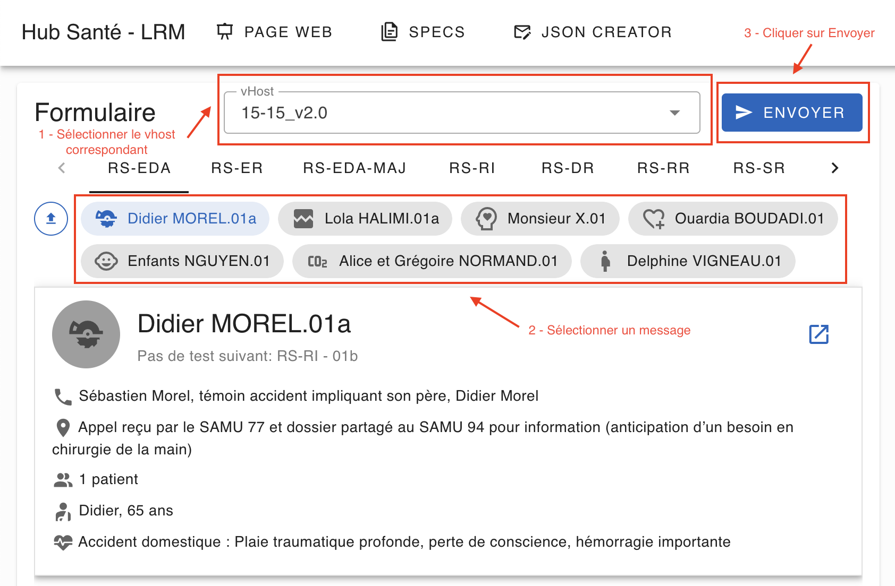
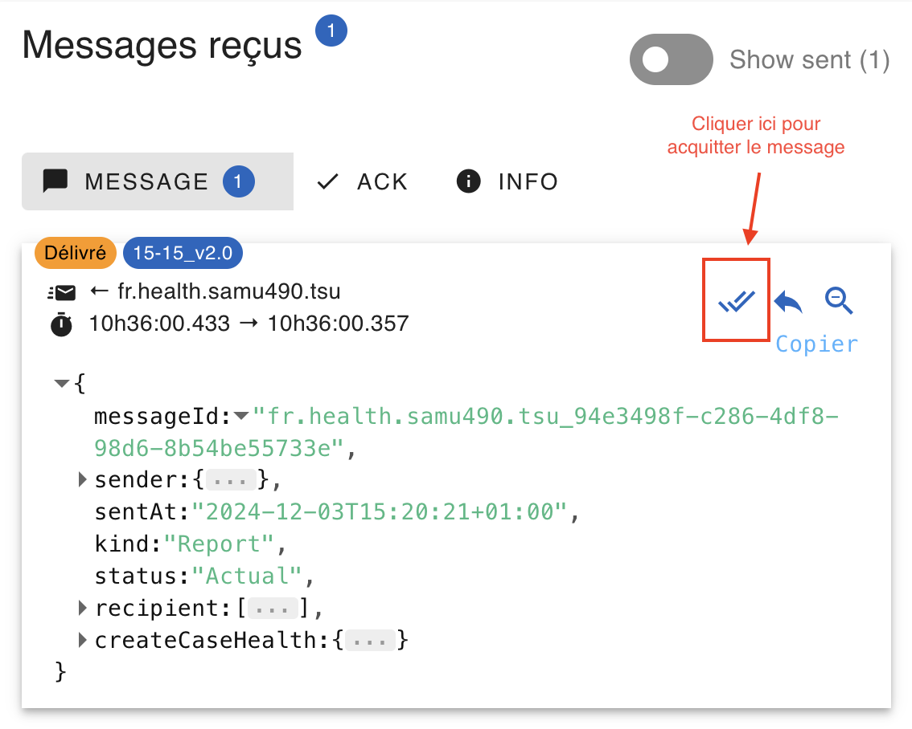

Les tutoriels suivants couvrent les principes d'échange de messages via le Hub Santé.

Grâce à ces tutoriels, vous allez apprendre à :

- Configurer la connexion au Hub Santé
- Envoyer des messages et les voir apparaître sur le LRM de test
- Recevoir des messages envoyés depuis le LRM de test et les voir apparaître dans votre terminal
- Gérer les mechanismes d'acquittements technique et fonctionnel.

## Pré-requis :

- Avoir obtenu un certificat IGC Santé
- Avoir généré la clé et le trust store correspondants

Si ce n'est pas fait, suivre le lien de documentation suivant : https://hub.esante.gouv.fr/pages/parcours.html#etape3.

## Pour commencer

À la racine du dossier `/clients`, créer un fichier `.env` et y définir vos variables d'environnement :

```
EXCHANGE_NAME=hubsante
HUB_HOSTNAME=messaging.bac-a-sable.hub.esante.gouv.fr
HUB_PORT=5671
VHOST=15-15_v2.0
KEY_PASSPHRASE=<passphrase of the .p12 key>
CERTIFICATE_PATH=<path/to/.p12/key>
TRUST_STORE_PASSWORD=<password of the trustStore>
TRUST_STORE_PATH=<path/to/trustore>
```

## Tutoriels

Les tutoriels se trouvent dans le dossier `/hubsante/examples`.

Il est possible de suivre les tutoriels pour échanger des messages soit au format JSON, soit au format XML.

À noter que la configuration par défaut d'un client sur le Hub Santé correspond à des envois et réceptions de messages au format JSON. Si vous souhaitez pouvoir échanger en XML et non en JSON, merci de l'indiquer à l'équipe Hub Santé lors de la configuration de votre client sur le Hub Santé.

### Getting Started

Pour démarrer, on va configurer la connexion au Hub Santé. L'objectif est de voir affiché dans le terminal un log suite à la réception d'un message envoyé depuis le LRM de test.

Dans le dossier `/clients`, lancer la commande:
`./gradlew run -Pmain=com.hubsante.examples._01_GettingStarted --args='<your_client_id>.message json'`

On va ensuite utiliser le LRM de test du Bac à Sable pour faire les tests de raccordement.

1. Ouvrir le lien https://bac-a-sable.hub.esante.gouv.fr/lrm
2. Sélectionner "ID du système utilisé" : "fr.health.test.<your_denomination>"
3. Sélectionner "ID du système cible" : <your_client_id>
4. Cliquer sur "LRM de Test"
5. [Attention] Bien sélectionner le vHost correspondant à la version de la dépendance "com.hubsante:models" définie dans le build.gradle ET correspondant à la variable d'environnement VHOST. Autrement, vous ne pourrez ni recevoir, ni envoyer de messages.
6. Sélectionner un message et cliquer sur "Envoyer"



Vous devez maintenant voir un log apparaître dans votre terminal.

À noter, que dans le cadre du LRM de test, on peut uniquement tester l'envoi de message au format JSON. Il ne peut pas être utilisé pour envoyer des messages XML.
Il peut cependant recevoir des messages JSON ou XML.

### Recevoir un message

Dans le dossier `/clients`, au choix :

Lancer la commande dans votre terminal:
`./gradlew run -Pmain=com.hubsante.examples._02_JsonReceiveMessage --args='<client_id>.message json'`

ou,
`./gradlew run -Pmain=com.hubsante.examples._02_XmlReceiveMessage --args='<client_id>.message xml'`

Puis, utilisez le LRM de test pour envoyer un message. Vous devez le voir apparaître dans votre terminal.

### Recevoir un message et gérer les cas d'erreur

Dans le dossier `/clients`, au choix :

Lancer la commande dans votre terminal:
`./gradlew run -Pmain=com.hubsante.examples._03_JsonReceptionErrorHandling --args='<client_id>.message json'`

ou,
`./gradlew run -Pmain=com.hubsante.examples._03_XmlReceptionErrorHandling --args='<client_id>.message xml'`

### Recevoir un message et envoyer ACK fonctionnel

Dans le dossier `/clients`, au choix :

Lancer la commande dans votre terminal :
`./gradlew run -Pmain=com.hubsante.examples._04_JsonReceiveAndAckMessage --args='<client_id>.message json'`

ou,
`./gradlew run -Pmain=com.hubsante.examples._04_XmlReceiveAndAckMessage --args='<client_id>.message xml'`

Puis, utilisez le LRM de test pour envoyer un message. Vous devez le voir apparaître dans votre terminal, suivi d'un log d'acquittement.

### Envoyer un message et recevoir l'ACK fonctionnel

Dans le dossier `/clients`, au choix :

Lancer la commande dans votre terminal :
`./gradlew run -Pmain=com.hubsante.examples._05_JsonSendMessage --args='<client_id> <path/to/message>'`
ou,
`./gradlew run -Pmain=com.hubsante.examples._05_XmlSendMessage --args='<client_id> <path/to/message>'`

Vous passez en argument le chemin du message à envoyer qui doit être au format JSON dans le premier cas, et XML dans le second.

Si le format du message envoyé est

- invalide, un log apparait dans le terminal
- valide, vous le voyez apparaître sur le LRM de test dans la file de message

Pour aller plus loin :
Combiner les deux derniers tutoriels :

- Ecoutez la queue "ack" en lançant dans un autre onglet de votre terminal : `./gradlew run -Pmain=com.hubsante.examples._04_JsonReceiveAndAckMessage --args='<client_id>.ack json'`
- Envoyez un message au Hub Santé
- Acquitter le message depuis le LRM de test en cliquant sur le tick de validation
  
  Vous recevez dans votre terminal l'ACK fonctionnel.
